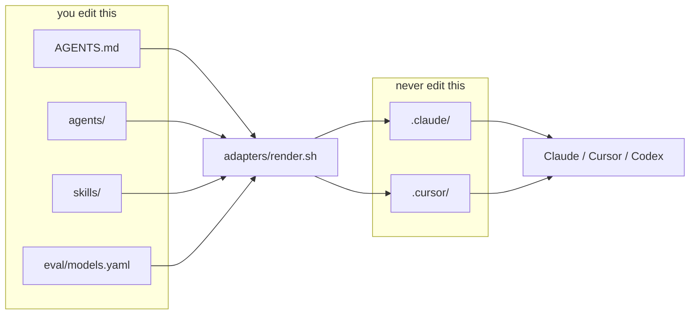
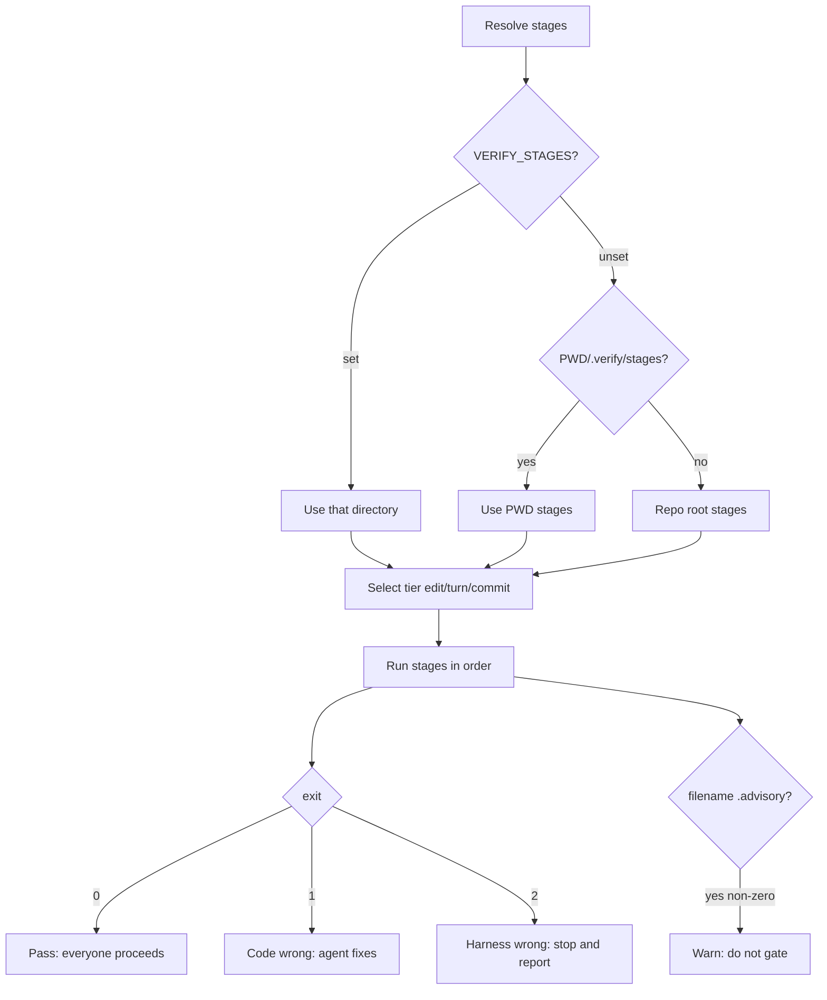
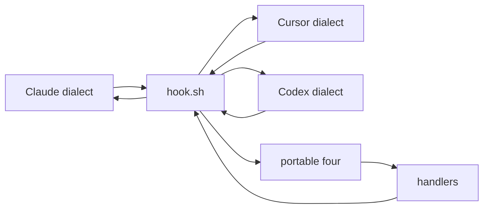

# Harness loop engineering

A reference implementation of an agentic coding harness, built as training
material for a workshop and a video course. The repo root is a template a team
can copy into their own codebase. `examples/` holds runnable lessons. The claim
is that a harness is not an IDE feature: the same roles, verification, and
enforcement should work under Claude Code, Cursor, or anything else, through a
thin generated adapter.

## Oracle strength

The weaker the deterministic oracle for a role, the stronger the model that role
needs. The reviewer's output is prose read by a human, and nothing in
`verify.sh` catches a defect it failed to mention, so it gets the deep tier.
QA's output is a reproduction that either fails on the broken commit and passes
on the fixed one or does not, so the fast tier is safe because its mistakes are
caught for free.

## Anatomy



Canonical sources feed `adapters/render.sh`. Generated adapters contain no
logic. Hand-editing `.claude/` or `.cursor/` is the most common newcomer
mistake and the next `render.sh` run will overwrite you.

| Path                    | Purpose                          | Edit this?      |
| ----------------------- | -------------------------------- | --------------- |
| `AGENTS.md`             | Short project context for agents | Yes             |
| `agents/`               | Canonical role prompts           | Yes             |
| `agents/*.rationale.md` | Why the tier was chosen          | Yes (humans)    |
| `skills/`               | On-demand procedures             | Yes             |
| `eval/models.yaml`      | Only place a model is named      | Yes             |
| `harness.config.yaml`   | All harness behaviour            | Yes (optional)  |
| `.verify/stages/`       | One tool call per stage          | Yes             |
| `scripts/`              | verify, hook, loop, scenario     | Yes             |
| `.claude/`, `.cursor/`  | Generated adapters               | No              |
| `.harness/`             | Runtime state                    | No (gitignored) |

## The developer loop


The correction cycles are the point. A happy-path-only diagram teaches nothing.
Edit-tier feedback arrives while the change is still small. Turn-tier feedback
catches what the file-local checks cannot. The commit gate compares a content
hash, not mtimes, so checkout and rebase do not produce false denials.

## Configuration

The whole file is optional. Delete it and everything runs on defaults. The only
mandatory settings anywhere in the repo are `loop.goal` and `loop.maxTurns`, and
only `scripts/loop.sh` requires them.

Every hook process reads the config at startup, so an edit applies on the next
event with no restart. That is an argument for hooks as processes rather than
plugins.

### If you change this

**`trace.level` events to full.** Before, a line records that the reviewer ran
and returned two findings. After, the same line carries the full prompt, the
diff it read, and its raw JSON. Use it when debugging a role, then turn it off,
because the trace now contains your source code.

**`review.maxCycles` 2 to 0.** Before, the reviewer sends the agent back twice.
After, findings still appear but the agent is never sent back and you read them
yourself. This is what scenario 01 needs.

**`loop.gate` on-commit to never.** Before, the loop pauses before the commit
lands. After, it commits without asking, which is right in a throwaway worktree
and wrong anywhere you care. Pair with a low `maxCostUsd` the first few times.

**`verify.failFast` true to false.** Before, the agent gets the first failing
stage. After, it gets everything, which sounds better and is not: agents given
nine failures pick the wrong one to start on. False in CI where a human reads
the whole picture, true where an agent is reading.

## Claude Code quickstart

```bash
scripts/setup.sh
adapters/render.sh
scripts/scenario.sh start 01-baseline
cd ../.scenarios/01-baseline
claude
```

Then `/agents` and `/hooks` to confirm wiring.

## Cursor quickstart

```bash
scripts/setup.sh
adapters/render.sh
scripts/scenario.sh start 01-baseline
```

Open the worktree as the workspace folder. Roles appear from `.cursor/agents/`.
Hooks reload automatically; restart if one seems inert. Cursor cloud agents pick
up `.cursor/hooks.json` from the project root and run it during their work,
which is when people realise enforcement follows the work off their machine.

## Codex

See [`.codex/README.md`](.codex/README.md). The adapter is intentionally not
built yet.

## How the pieces fit

### Verification



Exit 2 exists so an agent never spends twenty minutes rewriting working code
because a tool was not installed.

### Hook normalisation



Three tool dialects enter, normalise to `session_start`, `pre_tool`,
`post_tool`, and `stop`, then verdicts translate back out. That is the
tool-agnosticism argument in one picture.

### Roles and model binding


## Adoption

Once a team understands the pieces, the versioned package route is what they do
next: extract `scripts/`, `.verify/`, `agents/`, and the config loader into a
shared module. This repo stays a template you copy, so the seams stay visible
and extraction stays mechanical.

`.claude/` and `.cursor/` are generated. Re-run `adapters/render.sh` after
editing `agents/` or `eval/models.yaml`.
