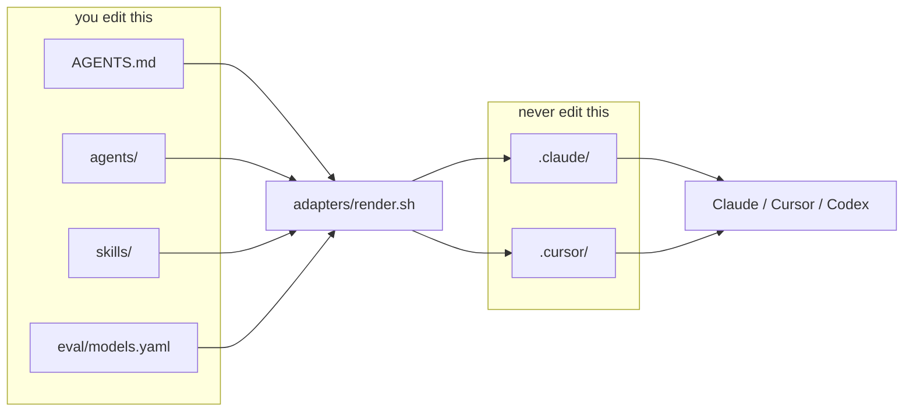
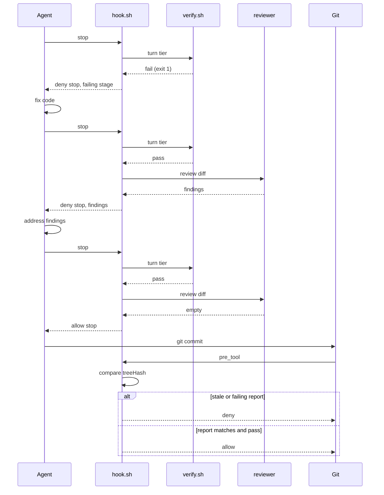
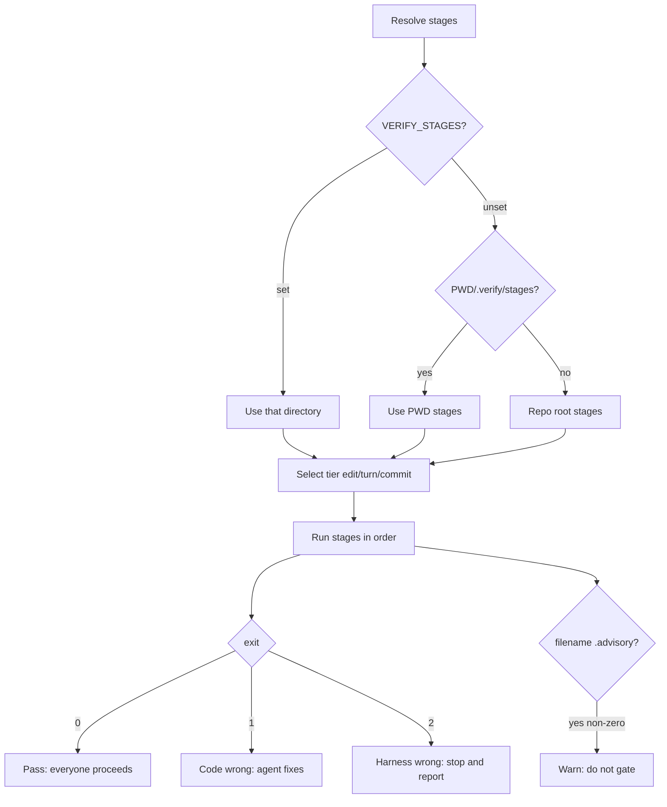
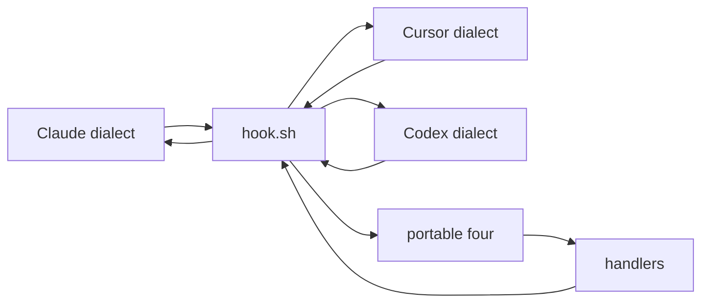

# Harness loop engineering

A harness does not make the model smarter. Benchmarks with a perfect hidden
oracle already grade that. What a harness manufactures is a definition of done
where the repository does not have one, and output a team can accept without a
human reading every line. Pass and fail stay exit codes, hashes, and empty
versus non-empty results. A model can advise. It never decides the gate.

The root is the template: short context in `AGENTS.md`, role prompts in
`agents/`, procedures in `skills/`, model bindings in `eval/models.yaml`, and
behaviour in `harness.config.yaml`. `adapters/render.sh` turns those into
tool-specific files under `.claude/` and `.cursor/` that you never edit by
hand. `scripts/verify.sh` and `scripts/hook.sh` enforce the loop. `examples/`
shows the pieces on a small two-service app. Drop the template into your own
repo, keep the examples or delete them, and tune the stages to your stack.

## Where a minimal harness wins

For an isolated task with a perfect oracle, added structure mostly gets in the
way. Scenario `00-minimal` is the control: bash only, no roles, no hooks, same
defect seed as the full newsletter harness. The repo ships its own counterexample
on purpose. See [REFERENCES.md](REFERENCES.md) for the benchmark numbers behind
that claim.

## Example ladder

| Scenario                | What it teaches                                       |
| ----------------------- | ----------------------------------------------------- |
| `00-minimal`            | Control. Unstructured baseline against the same seed. |
| `01-baseline`           | Underspecified prompt with harness wiring disabled.   |
| `02-context-only`       | Context files without enforcement.                    |
| `03-verify-in-the-loop` | Verification stages in the turn.                      |
| `04-enforcement`        | Hooks that deny stop and commit on red.               |
| `05-reading-the-trace`  | Using traces when a session compacted.                |
| `10-newsletter`         | Two-service app with planted defects D1 to D6.        |

## Oracle strength

The weaker the deterministic check for a role, the stronger the model that role
needs. The reviewer's output is prose a human or the stop hook reads, and
nothing in `verify.sh` catches a defect it failed to mention, so it gets the
deep tier. QA's output is a reproduction that either fails on the broken commit
and passes on the fixed one or does not, so the fast tier is safe because its
mistakes are caught for free.

## Anatomy



## A turn that fails, then recovers



The correction cycles are the point. A happy-path-only diagram teaches nothing.
Edit-tier feedback arrives while the change is still small. Turn-tier feedback
catches what the file-local checks cannot. The commit gate compares a content
hash, not mtimes, so checkout and rebase do not produce false denials.

Across sessions, `features.json` is the durable definition of done,
`PROGRESS.md` orients the next context window, and `scripts/init.sh` boots
whatever the project needs without rediscovering it. Sources:
[REFERENCES.md](REFERENCES.md).

## Configuration

The whole file is optional. Delete it and everything runs on defaults. The only
mandatory settings anywhere in the repo are `loop.goal` and `loop.maxTurns`, and
only `scripts/loop.sh` requires them.

Every hook process reads the config at startup, so an edit applies on the next
event with no restart. That is an argument for hooks as processes rather than
plugins.

### If you change this

**`trace.level` events to full.** Before, a line records that the reviewer ran
and returned two findings. After, the same line carries the full prompt, the
diff it read, and its raw JSON. Use it when debugging a role, then turn it off,
because the trace now contains your source code.

**`review.maxCycles` 2 to 0.** Before, the reviewer sends the agent back twice.
After, findings still appear but the agent is never sent back and you read them
yourself. This is what scenario 01 needs.

**`loop.gate` on-commit to never.** Before, the loop pauses before the commit
lands. After, it commits without asking, which is right in a throwaway worktree
and wrong anywhere you care. Pair with a low `maxCostUsd` the first few times.

**`verify.failFast` true to false.** Before, the agent gets the first failing
stage. After, it gets everything, which sounds better and is not: agents given
nine failures pick the wrong one to start on. False in CI where a human reads
the whole picture, true where an agent is reading.

**`loop.enumerateFirst` true to false.** Before, a fresh `loop.sh` run spends
its first turn writing `features.json` from the goal and does not implement.
After, the agent may start coding immediately and leave the next session without
an explicit outline of done. Keep true for unattended multi-session work.

## Claude Code quickstart

```bash
scripts/setup.sh
adapters/render.sh claude
scripts/scenario.sh start 00-minimal
cd ../.scenarios/00-minimal
```

Paste `examples/00-minimal/prompt` as the only instruction for the control run.
For the structured path, start `01-baseline` or `04-enforcement` instead, then
`/agents` and `/hooks` to confirm wiring. Omit the render target (or pass both)
to render every adapter; CI checks both.

## Cursor quickstart

```bash
scripts/setup.sh
adapters/render.sh cursor
scripts/scenario.sh start 00-minimal
```

Open the worktree as the workspace folder. For structured runs, roles appear
from `.cursor/agents/`. Hooks reload automatically; restart if one seems inert.
Cursor cloud agents pick up `.cursor/hooks.json` from the project root and run
it during their work, which is when people realise enforcement follows the work
off their machine.

## Codex

See [`.codex/README.md`](.codex/README.md). The adapter is intentionally not
built yet.

## How the pieces fit

### Verification



Exit 2 exists so an agent never spends twenty minutes rewriting working code
because a tool was not installed.

### Hook normalisation



Three tool dialects enter, normalise to `session_start`, `pre_tool`,
`post_tool`, and `stop`, then verdicts translate back out. That is the
tool-agnosticism argument in one picture.

### Roles and model binding


## Adoption

Copy the template into a codebase, run `scripts/setup.sh`, and point the stages
at your real lint, typecheck, and tests. When the layout is stable across
several repos, extract `scripts/`, `.verify/`, `agents/`, and the config loader
into a shared package. This repo stays a template so those seams stay visible
and extraction stays mechanical.

`.claude/` and `.cursor/` are generated. Re-run `adapters/render.sh` after
editing `agents/` or `eval/models.yaml`.

Claims and sources: [REFERENCES.md](REFERENCES.md).
