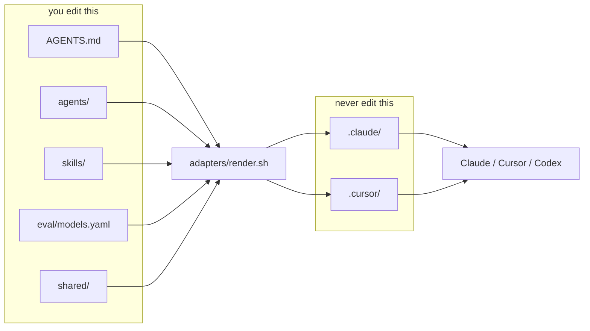
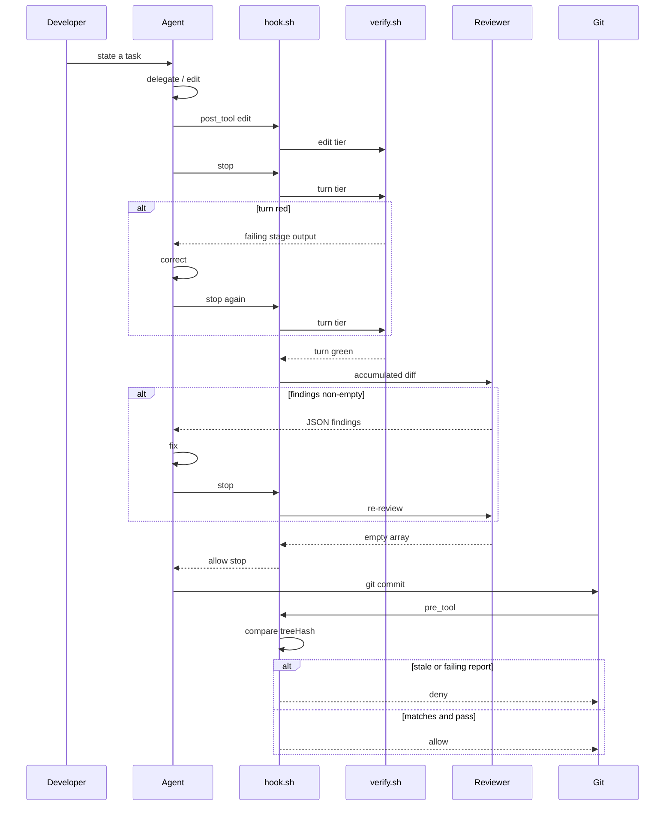
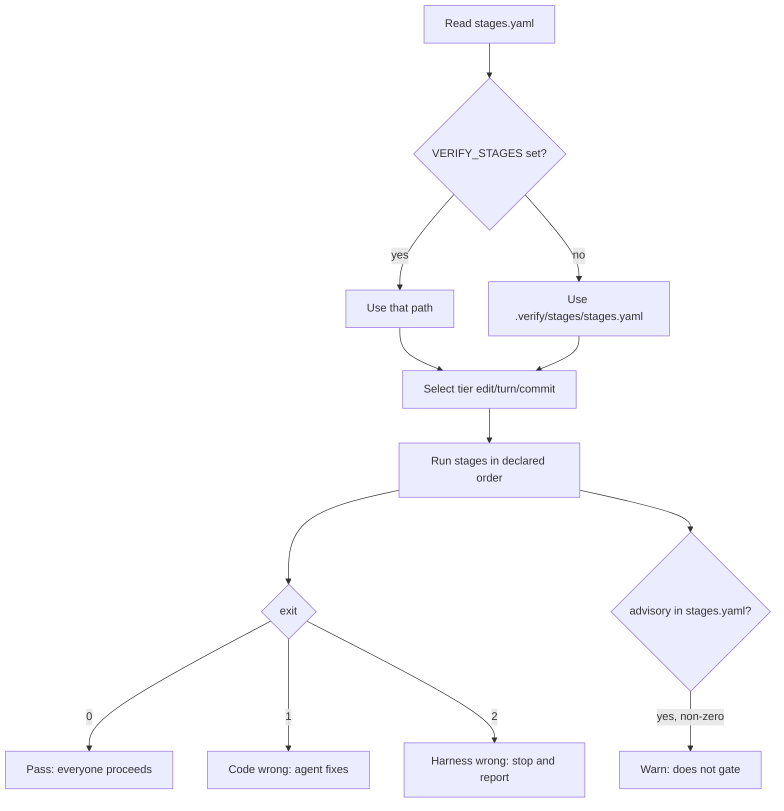
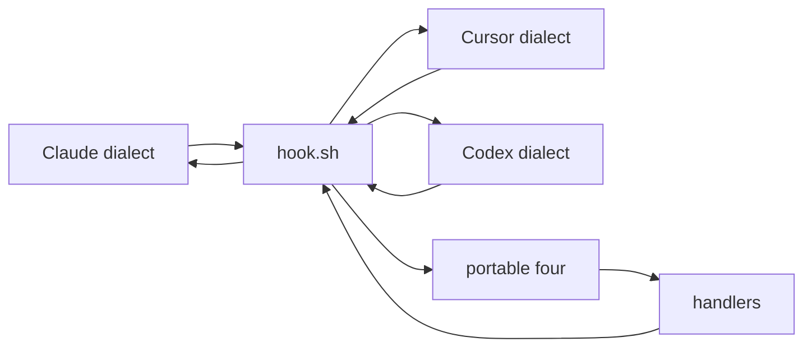
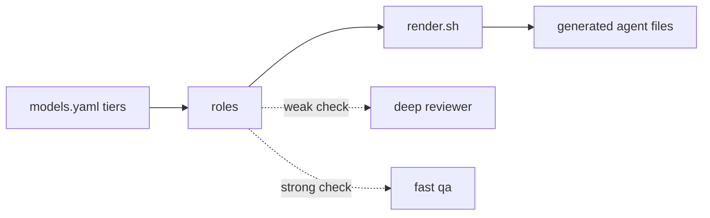

# Harness loop engineering

Coding agents write fast and forget what "done" means. This repo is a harness you
copy into a project so the agent works inside fixed roles, verification stages,
and hooks that run the same way under Claude Code, Cursor, or anything else.
Pass and fail stay exit codes, hashes, and empty versus non-empty results. A
model can advise. It never decides the gate.

The root is the template: short context in `AGENTS.md`, role prompts in
`agents/`, procedures in `skills/`, model bindings in `eval/models.yaml`, and
behaviour in `harness.config.yaml`. `adapters/render.sh` turns those into
tool-specific files under `.claude/` and `.cursor/` that you never edit by hand.
`scripts/verify.sh` and `scripts/hook.sh` enforce the loop. `examples/` shows the
pieces on a small two-service app, and ships a deliberate counterexample. Drop
the template into your own repo, keep the examples or delete them, and point the
stages at your stack.

## Check strength decides model strength

The weaker the deterministic check for a role, the stronger the model that role
needs. The reviewer's output is prose a human or the stop hook reads, and
nothing in `verify.sh` catches a defect it failed to mention, so it gets the
deep tier. QA's output is a reproduction that either fails on the broken commit
and passes on the fixed one or does not, so the fast tier is safe because its
mistakes are caught for free.

Testing literature calls this a test oracle. The phrasing here is "definition of
done", because that is the thing most repositories are missing and the thing a
harness exists to supply.

## Anatomy



Canonical sources feed `adapters/render.sh`. Generated adapters contain no
logic. Hand-editing `.claude/` or `.cursor/` is the most common newcomer mistake
and the next `render.sh` run will overwrite you.

| Path                         | Purpose                                            | Edit this?      |
| ---------------------------- | -------------------------------------------------- | --------------- |
| `AGENTS.md`                  | Short project context for agents                   | Yes             |
| `agents/`                    | Canonical role prompts                             | Yes             |
| `agents/*.rationale.md`      | Why the tier was chosen                            | Yes (humans)    |
| `skills/`                    | On-demand procedures                               | Yes             |
| `eval/models.yaml`           | Only place a model is named                        | Yes             |
| `harness.config.yaml`        | All harness behaviour                              | Yes (optional)  |
| `.verify/stages/stages.yaml` | Stage inventory: order, tier, advisory             | Yes             |
| `.verify/stages/`            | One tool call per stage                            | Yes             |
| `.verify/hooks/`             | Handlers, by normalised event                      | Yes             |
| `scripts/`                   | verify, hook, loop, scenario, sync, setup, init    | Yes             |
| `shared/`                    | Assets intended to be fanned out to consumer repos | Yes             |
| `harness.lock`               | Pinned version and content hashes of shared assets | Yes (committed) |
| `features.json`              | Definition of done that survives context loss      | Yes (optional)  |
| `PROGRESS.md`                | Handover note for the next session                 | Yes             |
| `.claude/`, `.cursor/`       | Generated adapters                                 | No              |
| `.harness/`                  | Runtime state, traces, loop state                  | No (gitignored) |

## The developer loop



Edit-tier feedback arrives while the change is still small. Turn-tier feedback
catches what the file-local checks cannot. The commit gate compares a content
hash, not mtimes, so checkout and rebase do not produce false denials.

Two of the four hook events can refuse, and neither refusal is a judgement. The
reviewer produces findings; what gates the turn is whether the list is empty.

## Verification

Stage inventory lives in `.verify/stages/stages.yaml`, which is the single source
of order, tier and advisory status. The `NN-` prefixes on the stage scripts are
naming only, and nothing infers policy from them.

| Stage             | Tier   | What it runs                                            |
| ----------------- | ------ | ------------------------------------------------------- |
| format            | edit   | Prettier check                                          |
| context-budget    | edit   | Token and line budgets for context, roles and skills    |
| context-nesting   | edit   | Nested `AGENTS.md` must not repeat ancestor lines       |
| lint              | edit   | ESLint                                                  |
| docs              | edit   | Mermaid blocks in markdown must parse                   |
| types             | turn   | TypeScript, no emit                                     |
| branch-convention | turn   | Advisory. `feat/<TASK-ID>-<slug>`                       |
| harness-drift     | turn   | `harness.lock` hashes against installed and upstream    |
| unit              | turn   | Vitest                                                  |
| no-tool-secrets   | turn   | Fails when rendered tool config holds credential values |
| features          | turn   | Falsifies `passes` claims in `features.json`            |
| boundaries        | turn   | dependency-cruiser architectural rules                  |
| build             | commit | Production build                                        |
| deps              | commit | Advisory. Dependency audit                              |
| suite             | commit | Full test suite                                         |



Exit 2 exists so an agent never spends twenty minutes rewriting working code
because a tool was not installed. Advisory stages exist because a check that
fails every morning does not get disabled on its own. The whole harness gets
disabled instead.

## Hook normalisation



Three tool dialects enter, normalise to `session_start`, `pre_tool`, `post_tool`
and `stop`, then verdicts translate back out. Only those four are depended on.
Anything else lives under `.verify/hooks/optional/` and nothing requires it.

| Event           | Handler                  | Blocks      |
| --------------- | ------------------------ | ----------- |
| `session_start` | `10-status`, `20-orient` | no          |
| `pre_tool`      | `10-guards`              | yes         |
| `post_tool`     | `10-edit-verify`         | no          |
| `stop`          | `10-verify-and-review`   | yes, capped |

An agent hook is weaker than a repository-level gate, because a hook only fires
if the agent is running this configuration. Anything you genuinely cannot allow
belongs in CI or a git hook, where it catches a human doing the same thing. Agent
hooks earn their place by arriving earlier than CI can. Both call the same
`verify.sh`, so there is one definition of done applied in two places.

## Scripts

Every script takes `-h`/`--help` and `-v`/`--version`. No flag takes a value:
flags select what a script does, and configuration supplies every parameter.

| Script                    | Usage                                                    |
| ------------------------- | -------------------------------------------------------- |
| `scripts/setup.sh`        | Install toolchain and dependencies. Idempotent           |
| `scripts/init.sh`         | Start what an end-to-end check needs. Safe every session |
| `scripts/verify.sh`       | `[edit\|turn\|commit]`, default `commit`                 |
| `scripts/hook.sh`         | Reads a hook payload on stdin. Not called by hand        |
| `scripts/scenario.sh`     | `start <name>`, `reset <name>`, `list`, `clean`          |
| `scripts/loop.sh`         | no flag, `--resume`, `--status`                          |
| `scripts/harness-sync.sh` | no flag, `--check`, `--status`                           |
| `adapters/render.sh`      | `[claude\|cursor]...`, `--check`                         |

## Configuration

The whole file is optional. Delete it and everything runs on defaults. The only
mandatory settings anywhere in the repo are `loop.goal` and `loop.maxTurns`, and
only `scripts/loop.sh` requires them.

Every hook process reads the config at startup, so an edit applies on the next
event with no restart. That is an argument for hooks as processes rather than
plugins.

### If you change this

**`trace.level` events to full.** Before, a line records that the reviewer ran
and returned two findings. After, the same line carries the full prompt, the diff
it read, and its raw JSON. Use it when debugging a role, then turn it off,
because the trace now contains your source code.

**`review.maxCycles` 2 to 0.** Before, the reviewer sends the agent back twice.
After, findings still appear but the agent is never sent back and you read them
yourself. This is what scenario 01 needs.

**`loop.gate` on-commit to never.** Before, the loop pauses before the commit
lands. After, it commits without asking, which is right in a throwaway worktree
and wrong anywhere you care. Pair with a low `maxCostUsd` the first few times.

**`verify.failFast` true to false.** Before, the agent gets the first failing
stage. After, it gets everything, which sounds better and is not: agents given
nine failures pick the wrong one to start on. False in CI where a human reads the
whole picture, true where an agent is reading.

**`loop.enumerateFirst` true to false.** Before, the first turn of a fresh run
writes `features.json` from the goal without implementing anything. After, it
starts building immediately. True is right across sessions, where a later agent
needs an explicit outline of what full functionality means. False is reasonable
inside one attended sitting, where the agent still holds its own list.

**`limits.skillBodyLines` 60.** Skill effectiveness degrades measurably above
roughly sixty lines, and long skills travel especially badly once shared across
repos. A skill that wants to be a hundred lines is usually two.

## Long-running work

Two failure modes appear as soon as work spans more than one context window. The
agent tries to do everything at once and runs out of room mid-change, leaving a
half-built feature nobody documented. Later, a fresh agent sees that progress has
been made and declares the job finished.

`features.json` answers the second. It is written once at the start, every entry
begins failing, and agents may only flip `passes` and name a `testId`. The
`features` stage then falsifies the claim: a feature marked passing must name a
test that exists and went green in this run, and entries may be added but never
removed. The published version of this idea guards the file with strongly worded
prose. Prose is a suggestion, so this repo checks instead.

`PROGRESS.md` and the `20-orient` session handler answer the first. A session
opens by finding out where it is: the working directory, recent git log, the tail
of the progress note, features passing out of total, and whether the basics still
work. Then, and only then, it picks something to do.

## Sharing across repositories

`shared/` holds the assets intended to leave this repo: skills, the reviewer
role, contracts, tool configuration and a stage fragment. A consumer repository
pins a version in `harness.lock`, which records a content hash per file, and runs
`scripts/harness-sync.sh` to pull the pinned version into place.

Distribution is pull based. This repo never pushes into a consumer and never
needs write access to one, which is what makes it adoptable in an organisation
where you do not own the other repositories.

The `harness-drift` stage compares each hash. Matching passes. Upstream ahead
with the local copy untouched warns, because being behind is a decision. A local
edit fails, naming the file, because that usually means a fix that should have
gone upstream. Nothing is auto-resolved and nothing is overwritten: a
distribution mechanism that silently destroys someone's work teaches an
organisation never to pin anything again.

A version string records what someone intended, and keeps claiming it after an
engineer edits a generated file to unblock themselves. Hashes record what is
actually there.

## Examples

```
scripts/scenario.sh start <name>
```

Creates a worktree at `../.scenarios/<name>`, applies the seed patch, writes
`.env.local` with a port derived from the scenario name so parallel worktrees do
not collide, and prints the example's README.

| Scenario                | What it shows                                                            |
| ----------------------- | ------------------------------------------------------------------------ |
| `00-minimal`            | The control. Bash only, no context, no roles, no hooks                   |
| `01-baseline`           | No harness. Plausible, confidently wrong output                          |
| `02-context-only`       | Context and skills, nothing else. The ceiling of instructions            |
| `03-verify-in-the-loop` | Checks plus the stop hook. The agent self-corrects                       |
| `04-enforcement`        | Skip the checks and commit, turn the gate on, watch the same prompt fail |
| `05-reading-the-trace`  | Turn tracing on and find out why a run went wrong                        |
| `10-newsletter`         | Two services, six planted defects, its own stage additions               |

`00-minimal` exists because the strongest published evidence in this field runs
against structured harnesses. A roughly hundred-line agent with nothing but bash
scores above 74% on SWE-bench Verified, and in at least one 2026 comparison beat
feature-rich agents on the same model. Those benchmarks grade against a hidden
test suite that is guaranteed correct and complete, so the definition of done is
supplied for free and perfectly. `00-minimal` runs against the same defect set as
the full harness so the difference is visible rather than asserted. Record what
actually happens, including results that do not flatter the harness.

`10-newsletter` plants six defects across two services. The one worth studying is
D3, a cross-service import of another service's internals. It passes format,
lint, types and every unit test, and only the boundary stage catches it. That is
the argument for architectural fitness functions over more tests.

## Evals

On demand only. Nothing in `eval/` is wired to a hook. Run it when you want to
know whether a role still performs after changing its model or its prompt. This
is a different mechanism from the reviewer that runs at end of turn on real work,
and they share a role definition and nothing else.

Scoring is set arithmetic against `defects.yaml`, which you wrote, so no judge
model appears anywhere in the path. Reaching for an LLM-as-judge framework when
you hold the answer key would add cost and nondeterminism to the one part of the
system whose purpose is being deterministic.

Replay mode is the default and reads recorded responses from `eval/fixtures/`, so
a clone runs the suite offline and without an API key.

**The numbers currently in `eval/results/` come from replay fixtures rather than
live calls.** Every row reports identical wall clock and cost across repeats and
across models, which is replay working as designed and is not evidence about
models. Treat them as a smoke test of the harness until a live run replaces them.

What these numbers cannot see, even when live:

- Differences under roughly fifteen points, with six defects and three repeats
- A category collapsing behind a steady aggregate
- Whether the role was invoked at all, since eval calls it directly
- What a summary dropped on the way back to the main thread
- One role getting worse because another one did
- Whether a correct finding was explained well enough to act on
- Whether the context and hooks are still doing their job

## Claude Code quickstart

```
scripts/setup.sh
adapters/render.sh claude
scripts/scenario.sh start 01-baseline
cd ../.scenarios/01-baseline
claude
```

Then `/agents` and `/hooks` to confirm wiring. Omit the target, or pass both, to
render every adapter; CI checks both.

## Cursor quickstart

```
scripts/setup.sh
adapters/render.sh cursor
scripts/scenario.sh start 01-baseline
```

Open the worktree as the workspace folder. Roles appear from `.cursor/agents/`.
Hooks reload automatically; restart if one seems inert. Cursor cloud agents pick
up `.cursor/hooks.json` from the project root and run it during their work, which
is when people realise enforcement follows the work off their machine.

## Codex

See [`.codex/README.md`](.codex/README.md). The adapter is intentionally not
built yet. An unfinished third adapter is better evidence for the
tool-agnosticism claim than two polished ones, because it shows the seam.

## Roles and model binding



`eval/models.yaml` is the only file that names a model. Roles reference a tier,
so changing which model reviews your code is a one-line diff on a file under
`CODEOWNERS` rather than an archaeology exercise, and CI can gate it on an eval
comparison.

Each role ships a sibling `*.rationale.md` recording check strength, failure
cost, run frequency, context need, the evidence behind the tier, and the
falsifiable condition that would change the choice. The rationale sits beside the
prompt rather than inside it, because the prompt is loaded by the model on every
use and a repo that argues context bloat costs success rate should not ship
teaching commentary inside the files agents read.

A subagent cannot spawn another subagent. Composition lives in a command, a
script, or a person, which is why there is no orchestrator here.

## Governance and sources

[`GOVERNANCE.md`](GOVERNANCE.md) covers what leaves the machine, what the
committed eval fixtures contain, what `trace.level: full` captures and why it is
off by default, and what a regulated deployment would change.

[`REFERENCES.md`](REFERENCES.md) carries the sources behind the claims here,
marked primary or secondary. Several widely circulated pieces on this topic are
themselves AI-generated and unverified, and those are flagged.

## Repository architecture

Agents raise the cost of the polyrepo failure mode, since drift now changes
behaviour rather than merely annoying people, and they lower the cost of some
monorepo tooling. Both shift the balance and neither decides it. Standing up a
canonical layer with fan-out and a drift check is about a week for one engineer,
and a monorepo migration is a quarter with a permanent tooling commitment
attached. Boundaries should still follow teams and change cadence, exactly as
they did before. Some current writing argues more strongly for consolidation; see
`REFERENCES.md`.

## Adoption

Copy the template into a codebase, run `scripts/setup.sh`, and point the stages
at your real lint, typecheck and tests. Add one fitness function for the
architectural decision you are most tired of re-explaining in review. Add one
blocking hook, and only one. Then plant three defects and find out what your
setup catches.

When the layout is stable across several repos, extract `scripts/`, `.verify/`,
`agents/` and the config loader into a shared package. This repo stays a template
so those seams stay visible and extraction stays mechanical.

`.claude/` and `.cursor/` are generated. Re-run `adapters/render.sh` after
editing `agents/` or `eval/models.yaml`.
